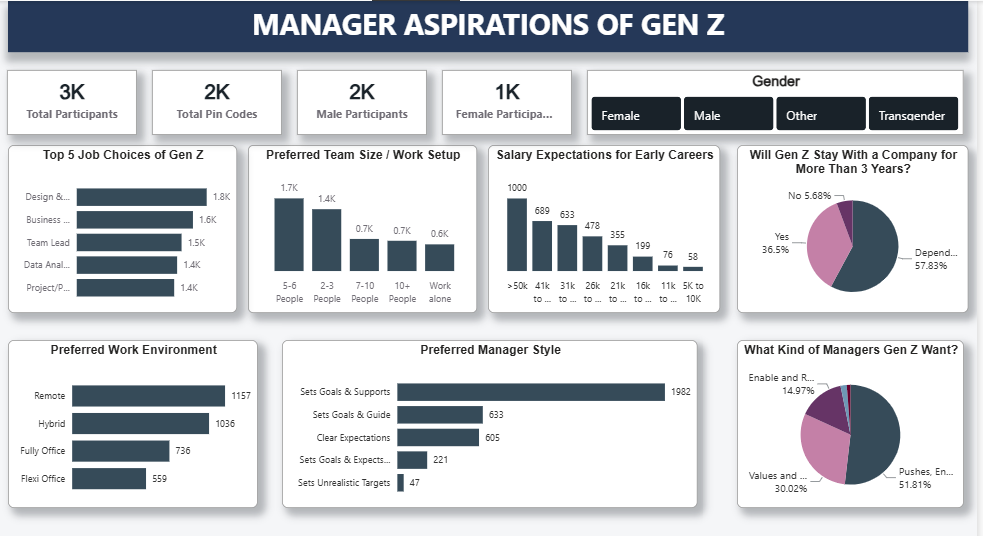
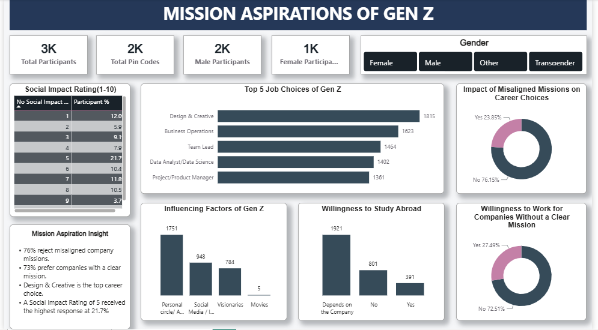

# Gen Z Career Aspirations Analysis

## Project Overview

This project explores the career expectations of Gen Z, with a focus on what young professionals value in managers, workplace environments, company mission, career growth, flexibility, and compensation.

The goal was to identify the gap between what Gen Z expects from employers and what organizations currently provide.

The project combines:

- Gen Z survey analysis
- Data cleaning and preparation
- Power BI dashboard development
- DAX measures
- Manager Aspirations analysis
- Mission Aspirations analysis
- Flipkart employee-review analysis
- Employer recommendations

---

## Business Problem

Employers often struggle to understand what Gen Z expects from the workplace.

This can lead to:

- Difficulty attracting young talent
- Early employee attrition
- Poor manager-employee alignment
- Unclear career expectations
- Weak employer branding

The main question explored was:

> What does Gen Z value at work, and what can employers do to attract and retain them?

---

## Dataset

- 3,615 unique participants
- 1,805 distinct pin codes
- Gen Z students, job seekers, fresh graduates and early-career professionals
- Indian job market focus

The cleaned dataset contained expanded responses, so participant-level analysis used DISTINCTCOUNT instead of normal row counts.

---

## Tools Used

- Excel
- Power Query
- Power BI
- DAX
- Data Cleaning
- Data Visualization
- Employee Review Analysis

---

## Dashboard 1 — Manager Aspirations

This dashboard focuses on:

- Preferred manager style
- Preferred work environment
- Long-term employment willingness
- Workplace expectations
- Salary expectations
- Workplace frustrations

### Key Findings

- 79% prefer Remote, Hybrid or Flexi work arrangements.
- 57% prefer managers who set goals and support employees.
- 57.7% say staying more than 3 years depends on the company.

### Business Insight

Gen Z is not necessarily unwilling to stay with one company. Their willingness to stay appears strongly influenced by manager quality and workplace experience.

---

## Dashboard 2 — Mission Aspirations

This dashboard focuses on:

- Company mission alignment
- Social impact
- Career aspirations
- Workplace happiness
- Employer preferences

### Key Findings

- 76.1% reject companies whose mission conflicts with their values.
- 72.2% avoid companies without a clear mission.
- Social-impact rating 5 was the most common response.

### Business Insight

Company purpose matters, but Gen Z appears to value clarity and authenticity more than generic purpose statements.

---

## Flipkart Employer Case Study

To connect the survey findings with a real employer, Flipkart employee reviews were analysed across:

- Indeed
- Glassdoor
- AmbitionBox
- TeamBlind

### Strengths Identified

- Learning opportunities
- Company culture
- Ownership
- Supportive teams in many areas

### Common Challenges

- Compensation and salary hikes
- Promotion transparency
- Manager-dependent experiences
- Career progression
- Workload pressure in some teams

---

## Gen Z Expectations vs Flipkart Review Signals

The strongest alignment was found in:

- Learning
- Culture
- Ownership

The largest potential gaps were found in:

- Manager consistency
- Career growth
- Promotion fairness
- Compensation

---

## Recommendations

1. Improve career and promotion transparency.
2. Strengthen manager coaching and feedback skills.
3. Benchmark compensation for high-demand roles.
4. Introduce structured early-career mentorship and learning.
5. Test improvements through a 90-day pilot before scaling.

---

## Project Outcome

This project delivered:

- 2 interactive Power BI dashboards
- Cleaned and structured survey data
- KPI and comparison analysis
- Employer review benchmark
- Gen Z vs employer gap analysis
- Actionable HR and recruitment recommendations

---

## Dashboard Preview

### Manager Aspirations

### Mission Aspirations

---

## Key Learning

This project helped me understand that data analysis is not only about creating charts.

The real value comes from identifying meaningful patterns, communicating the insight clearly, and connecting the analysis to a business decision.
